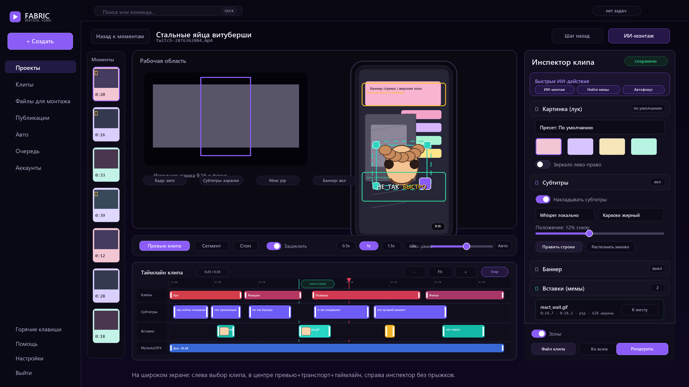
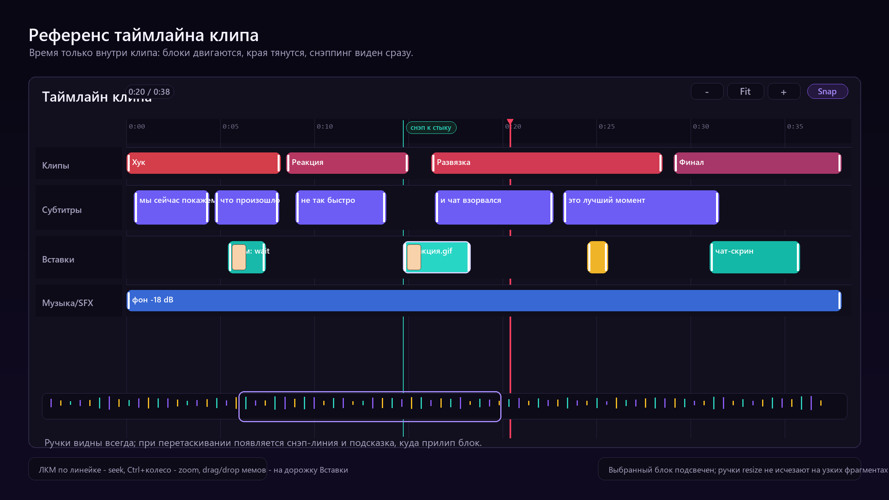
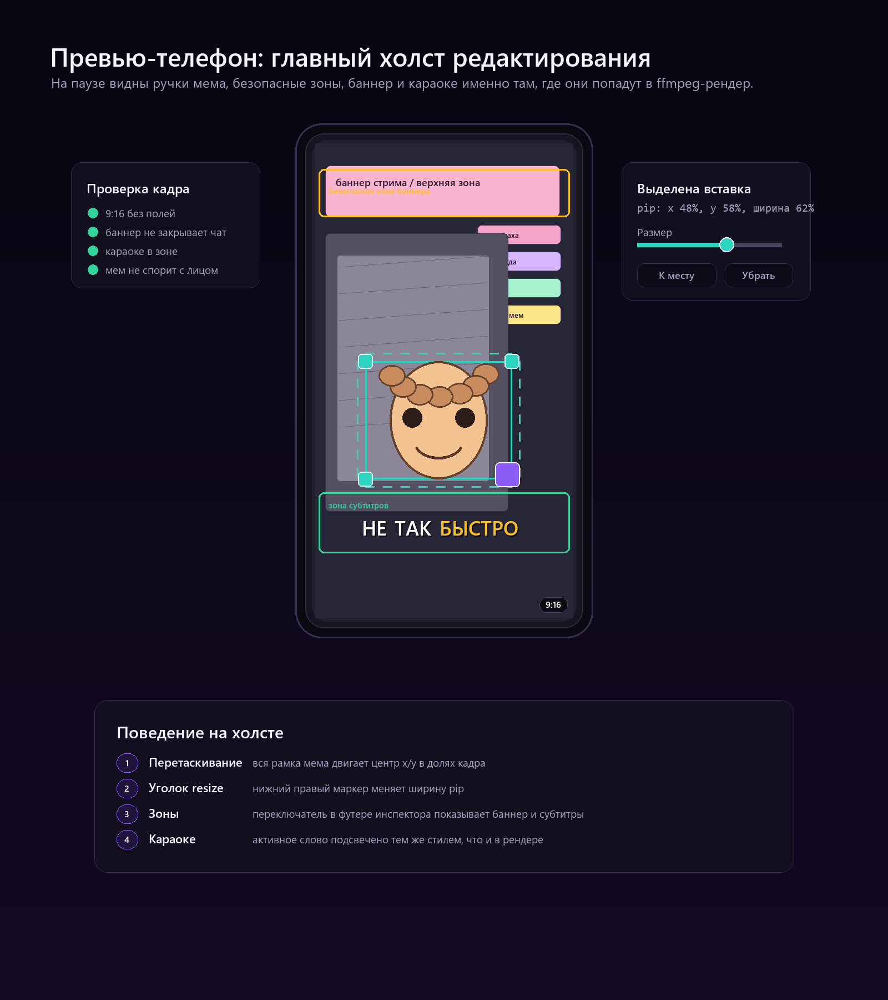
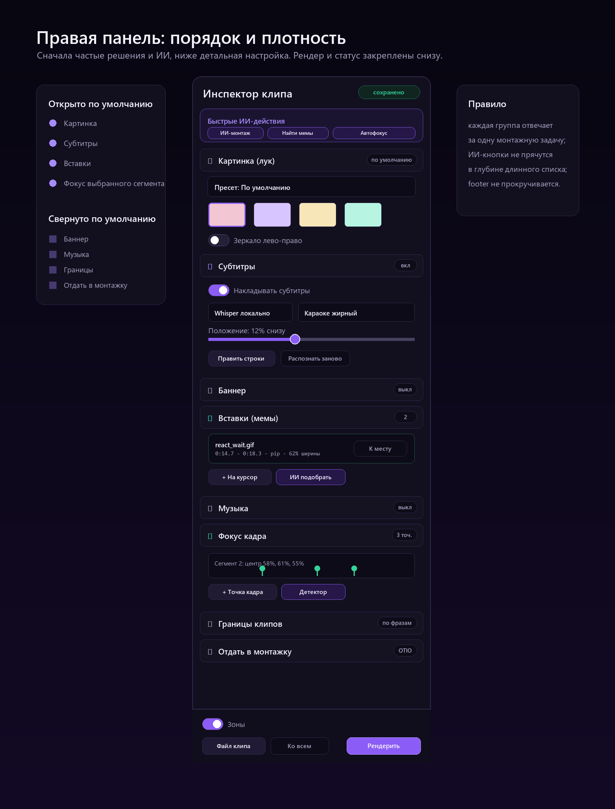

# Референсы редактора клипа 2

Основа: текущие скриншоты [`live-editor-368-1600x1000.png`](../editor/shots/live-editor-368-1600x1000.png) и [`live-moments-1600x1000.png`](../editor/shots/live-moments-1600x1000.png), плюс текущая сборка редактора в `frontend/src/pages/workspace/*.tsx`.

## Нарисованные референсы

`ref2-editor-full.png` показывает идеальную компоновку для широкого экрана 2560: слева навигация и список моментов, в центре рабочая область с главным 9:16 превью, ниже транспорт и крупный таймлайн, справа закреплённый инспектор.

`ref2-timeline.png` показывает таймлайн крупно: время клипа, дорожки «Клипы», «Субтитры», «Вставки», «Музыка/SFX», видимые ручки resize, playhead, снэп-линию и нижний overview/zoom.

`ref2-preview.png` показывает телефон как главный холст: референс рамки выделения pip-мема, углов resize, безопасных зон, баннера и караоке-субтитров.

`ref2-inspector.png` показывает правую панель: порядок групп, что открыто по умолчанию, что свёрнуто, где живут быстрые ИИ-действия и закреплённый футер рендера.

## Что сейчас мешает работать

1. В центре одновременно конкурируют исходник и телефон. В [`CandidatesTab.tsx`](../../../frontend/src/pages/workspace/CandidatesTab.tsx#L1944) вся сцена собирается как `ed-stage-row`: исходное видео с рамкой и отдельный `ed-phone`. Функционально это правильно, но в текущем виде телефон не выглядит главным объектом редактирования, хотя именно он отвечает на вопрос «что выйдет в 9:16».

2. Таймлайн находится ниже транспорта и заметно ниже основного внимания. Он подключён в [`CandidatesTab.tsx`](../../../frontend/src/pages/workspace/CandidatesTab.tsx#L2117), а библиотека вставок идёт сразу после него в [`CandidatesTab.tsx`](../../../frontend/src/pages/workspace/CandidatesTab.tsx#L2172). На скриншоте это превращает самый важный монтажный инструмент в нижний блок, который легко потерять за сгибом.

3. Сам `ClipTimeline` уже умеет нужную механику, но визуально недодаёт уверенности. Снэппинг считается в [`ClipTimeline.tsx`](../../../frontend/src/pages/workspace/ClipTimeline.tsx#L137), zoom спрятан в маленьких `− / Fit / +` в [`ClipTimeline.tsx`](../../../frontend/src/pages/workspace/ClipTimeline.tsx#L240), дорожки объявлены в [`ClipTimeline.tsx`](../../../frontend/src/pages/workspace/ClipTimeline.tsx#L256), а блоки и ручки живут в [`ClipTimeline.tsx`](../../../frontend/src/pages/workspace/ClipTimeline.tsx#L291). Нужно не переписывать логику, а сделать ручки, снэп и выбранный блок крупнее и явнее.

4. Инспектор слишком длинный для ежедневного сценария. Группы идут подряд в [`CandidatesTab.tsx`](../../../frontend/src/pages/workspace/CandidatesTab.tsx#L2191): «Картинка», «Субтитры», «Баннер», затем ещё «Переходы», «Обложка», «Вставки», «Музыка», «Умный кадр», «Фокус кадра», «Границы», «Отдать». При этом футер со статусом, зонами, JSON и рендером закреплён отдельно в [`CandidatesTab.tsx`](../../../frontend/src/pages/workspace/CandidatesTab.tsx#L2773). В результате пользователь скроллит панель ради частых действий.

5. Редактор строк субтитров находится внутри узкого инспектора. Это реализовано в [`SubtitleEditor.tsx`](../../../frontend/src/pages/workspace/SubtitleEditor.tsx#L150): список строк, тайминги, split/delete и save работают, но при большом количестве строк узкая колонка превращает правку текста в микроскоп.

6. Библиотека мемов уже встроена и drag/drop есть в [`AssetDrawer.tsx`](../../../frontend/src/pages/workspace/AssetDrawer.tsx#L26), но она воспринимается как дополнительный drawer, а не как часть дорожки «Вставки». В идеале пользователь должен видеть связь: нашёл мем -> положил на таймлайн -> поправил на телефоне.

## Что поменять в компоновке

Главный принцип: редактор должен вести взгляд по монтажному циклу. Сначала выбираем момент, затем смотрим телефон, затем двигаем время, затем уточняем параметры справа.

1. Сделать 9:16 телефон главным превью в центральной зоне. Исходник с рамкой оставить рядом, но визуально вторым: он нужен для понимания crop/focus, а не для оценки итогового клипа. Это видно в `ref2-editor-full.png` и `ref2-preview.png`.

2. Поднять и укрупнить таймлайн. Он должен занимать всю ширину центральной рабочей области под транспортом, с понятной высотой дорожек и видимыми ручками. Детализация показана в `ref2-timeline.png`.

3. Инспектор превратить в панель задач, а не длинный список настроек. Вверху — быстрые ИИ-действия: «ИИ-монтаж», «Найти мемы», «Автофокус». Дальше группы по частоте использования: «Картинка», «Субтитры», «Вставки», «Фокус кадра». «Баннер», «Музыка», «Границы клипов», «Отдать в монтажку» сворачивать по умолчанию. См. `ref2-inspector.png`.

4. Футер инспектора закрепить всегда: статус сохранения, «Зоны», «Файл клипа», «Ко всем», «Рендерить». Пользователь не должен искать рендер после прокрутки.

5. Правку субтитров оставить в инспекторе как компактный вход, но дать нормальное рабочее состояние: раскрытый блок/оверлей/нижний drawer с широкими строками. Тайминги по-прежнему синхронизируются с таймлайном.

## Приоритеты

1. Самая быстрая польза: поменять порядок и default-open/default-collapsed групп инспектора, закрепить футер и вынести ИИ-действия наверх. Это почти не трогает доменную логику.

2. Укрупнить центральную компоновку: телефон сделать главным, исходник вторичным, транспорт держать между превью и таймлайном. В основном это CSS и перестановка существующих блоков.

3. Улучшить визуал таймлайна: выше дорожки, постоянные ручки resize, явный selected-state, снэп-линия, более заметный playhead, аккуратный zoom/fit. Логика `ClipTimeline` уже есть.

4. Допилить overlay телефона: ручки pip крупнее, resize-угол контрастнее, безопасные зоны с понятными подписями, мини-индикатор выбранной вставки.

5. Связать `AssetDrawer` с дорожкой «Вставки»: drawer должен ощущаться как полка таймлайна, а не отдельный виджет. Кнопку «ИИ подобрать» лучше держать рядом с группой «Вставки».

6. После этого решать большой режим правки субтитров: не переписывать распознавание, а дать удобный широкий редактор строк.

## Уже сделано и не требует нового проектирования

Не нужно заново предлагать и переделывать базовую функциональность:

- вкладка «Моменты» и вход в редактор на `/projects/{id}/candidates?clip={planId}`;
- телефон-превью 9:16 с реальным кадром, баннером, караоке-субтитрами и мем-вставками;
- перемещение pip-мема мышью и resize за угол;
- `Ctrl+Z`/серверная история правок;
- таймлайн во времени клипа с дорожками, drag/resize/snap;
- правый инспектор с настройками картинки, субтитров, баннера, вставок, музыки, фокуса, границ и экспорта в монтажку;
- ИИ-монтаж, ИИ-поиск мемов, ИИ-выбор лучших моментов;
- серверный ffmpeg-рендер и публикации в YouTube/TikTok/Instagram.

Задача редизайна — не добавить ещё один слой функций, а расставить уже готовые инструменты так, чтобы монтаж клипа ощущался как один короткий рабочий проход.
