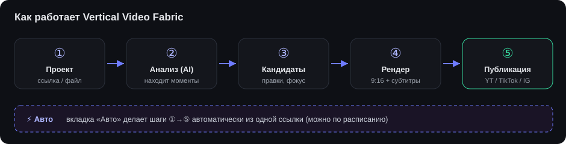

# Vertical Video Fabric — руководство пользователя

Сервис превращает длинное видео в готовые вертикальные клипы (9:16) с субтитрами и
публикует их в YouTube, TikTok и Instagram. Можно делать всё вручную по шагам или
запустить полностью автоматический конвейер из одной ссылки.

---

## 1. Вход

1. Откройте `http://<адрес-сервера>:8088` (локально — `http://localhost:8088`).
2. Введите токен доступа (его выдаёт администратор сервиса).
3. Готово — слева появится меню.

---

## 2. Навигация (меню слева)

| Пункт | Зачем |
|---|---|
| **🎬 Проекты** | Ваши исходные видео. С проекта начинается вся работа. |
| **✂️ Клипы** | Общая библиотека всех готовых клипов. |
| **⚡ Авто** | Автоконвейер: ссылка → нарезка → рендер → публикация. |
| **📡 Публикации** | Что и куда опубликовано, со статусами. |
| **🗂️ Задачи** | Лог выполнения: анализы, рендеры, публикации в реальном времени. |
| **👤 Аккаунты** | Подключённые аккаунты YouTube / TikTok / Instagram. |
| **⚙️ Настройки** | Пресеты рендера (луки), баннеры, музыка, стили субтитров, промпты, значения по умолчанию. |

---

## 3. Быстрый старт (ручной режим)

### Шаг 1. Создать проект
**Проекты → Добавить**: вставьте ссылку (mp4/YouTube/Twitch/Smotvibe) **или** загрузите файл.
Сервис скачает/примет видео — появится карточка проекта.

### Шаг 2. Вкладка «Исходник»
- При необходимости **обрежьте чёрные полосы** по краям (ползунки сверху/снизу/слева/справа,
  кнопка «🔍 Найти полосы» сделает это автоматически) → «Сохранить кадр». Применится ко всем клипам проекта.
- Запустите анализ: выберите **Пресет анализа** (под контент — Apex / аниме / сериал / подкаст /
  обучалка / юмор / боевик), **Провайдер** (gemini — основной) и нажмите **«Анализировать»**.
- Галка **«Транскрипт (Whisper) в анализ»** (вкл по умолчанию для Gemini) — даёт модели дословную
  расшифровку речи: точнее границы нарезки и цитаты. Транскрипт кэшируется, повторный анализ его переиспользует.

### Шаг 3. Вкладка «Кандидаты»
Здесь AI-нарезка превращается в готовые клипы. Слева — большое превью, под ним — таймлайн,
справа — панель **«Рендер»**.

- **Чипы кандидатов** внизу: у каждого видно длительность; клик — открыть в превью, галочка — включить в рендер.
- **Превью** показывает рамку 9:16 (что войдёт в вертикальный кадр) и зоны баннера/субтитров.
  Рамка следует за «точкой интереса» (фокусом).
- **Фокус (куда смотрит кадр):** кнопка **«🎯 Авто-фокус: все клипы»** прогоняет детектор лиц/движения
  по всем кандидатам; «Только этот план» — по активному. Можно править вручную точками на таймлайне.
- **Панель «Рендер»:**
  - **Пресет** — лук/фильтр (Кинематограф, Тёплый, Сочный, Нуар, Плёнка и т.д.). В превью лук виден сразу.
  - **Субтитры** — отдельно **движок** (Whisper локально / Gemini) и **стиль** (Классика, TikTok жёлтый,
    Караоке, Неон…), + ползунок положения.
  - **Баннер** — выбор картинки + высота и положение (видно на превью).
  - **Музыка** — фоновый трек.
  - **Зоны на превью** — показать/скрыть рамки баннера и субтитров.
- Отметьте нужные чипы и нажмите **«▶ Рендерить выбранные (N)»**. Прогресс — на странице **Задачи**.

### Шаг 4. Вкладка «Клипы»
Готовые клипы. У каждого — **«Опубликовать»** и **«Удалить»**. Превью проигрывается прямо в карточке.

### Шаг 5. Публикация
**«Опубликовать»** → выберите аккаунт(ы)-цель и приватность → отправьте. Статус — на странице
**Задачи** или **Публикации** (`succeeded` / `failed` / `needs_reauth`).

---

## 4. Автоконвейер (вкладка «Авто»)

Всё вышеперечисленное одной кнопкой:

1. Вставьте **ссылку** на видео.
2. Выберите **пресет анализа** и **провайдер**, **макс. клипов**, приватность.
3. Блок **«Оформление клипов»** — те же настройки, что в ручном рендере: пресет/лук, субтитры
   (движок + стиль + позиция), баннер (выбор + высота), музыка.
4. Отметьте **аккаунты** для публикации.
5. **Интервал, ч** — `0` = опубликовать сразу; иначе клипы публикуются с заданным шагом (расписание).
6. **▶ Запустить** — сервис скачает, проанализирует, отрендерит и опубликует сам.

Ход — на страницах **Задачи** и **Авто** (список запусков с прогрессом).

---

## 5. Аккаунты

**Аккаунты → Добавить**: платформа (youtube / tiktok / instagram), метка, (опц.) прокси и cookies
залогиненного аккаунта. Подробная инструкция со скриншотами: **[Импорт cookies](cookie-import.md)**.

- Минимум: YouTube — `SID, HSID, SSID, APISID, SAPISID`; TikTok и Instagram — `sessionid`.
- Статус **«готов»** = обязательные куки распознаны.
- YouTube-сессия **самообновляется** после каждой загрузки — куки живут долго.
- Желательно: один прокси на аккаунт, тот же регион/IP, что при снятии куки.

---

## 6. Настройки (заготовки)

Сервис уже идёт с дефолтным паком (луки, стили субтитров, промпты). Доп. настроить:

- **Пресеты рендера** — цветовые луки, виньетка/зерно, музыка, целевое 9:16, «умный кадр».
- **Баннеры** — загрузка картинок-плашек.
- **Музыка** — фоновые треки (громкость, луп, fade, ducking под речь).
- **Субтитры** — стили (шрифт, цвета, размер, положение, караоке-подсветка).
- **Промпты** — тексты для AI-анализа под разный контент (можно редактировать и добавлять).
- **По умолчанию** — что подставлять автоматически.

---

## 7. Частые сценарии

- **Нарезать сериал/боевик** → пресет анализа «Series analysis» (рекап) или «Action drama highlights».
- **Подкаст/интервью в шортсы** → пресет «Подкаст: цитаты», движок субтитров Whisper.
- **Свой смонтированный клип** → проект → вкладка **Смонтированные** → «Загрузить клип» (готовая вертикалка
  публикуется как обычный клип, можно дожать субтитрами/баннером).
- **Массовый автопостинг** → вкладка **Авто**, ссылка + аккаунты + интервал, и сервис ведёт всё сам.

---

## 8. Статусы

| Статус | Значение |
|---|---|
| `queued` | в очереди, ждёт обработки |
| `running` / `rendering` / `analyzing` | выполняется |
| `succeeded` / `done` | успешно |
| `failed` | ошибка (текст — в задаче) |
| `needs_reauth` | куки аккаунта больше не принимаются — обновите их в «Аккаунты» |

---

## 9. Если что-то не так (FAQ)

- **Анализ упал с «high demand»** — перегрузка Gemini на стороне Google, не сбой сервиса.
  Просто перезапустите анализ; обычно со второго раза проходит.
- **Анализ долго думает** — это первый проход распознавания речи (Whisper). Результат кэшируется,
  следующий анализ того же видео быстрее.
- **Публикация → `needs_reauth`** — cookies устарели или платформа просит проверку.
  Обновите cookies аккаунта (см. [Импорт cookies](cookie-import.md)).
- **TikTok/Instagram просит captcha/challenge** — войдите в аккаунт в браузере, пройдите проверку,
  снимите свежие cookies. Для Instagram лучше прогревать аккаунт и не лить десятками в час.
- **Клип не той ориентации / кадр «не туда»** — на вкладке «Кандидаты» поправьте фокус
  («🎯 Авто-фокус» или вручную) и перерендерьте.
- **Видео с чёрными полосами** — обрежьте их на вкладке «Исходник» и сохраните кадр.

---

## 10. Памятка по безопасности

- Cookies — это ключ от аккаунта. Не пересылайте их в мессенджеры/почту, вставляйте только в поле сервиса.
- Доступ к сервису — по токену; не публикуйте его.
